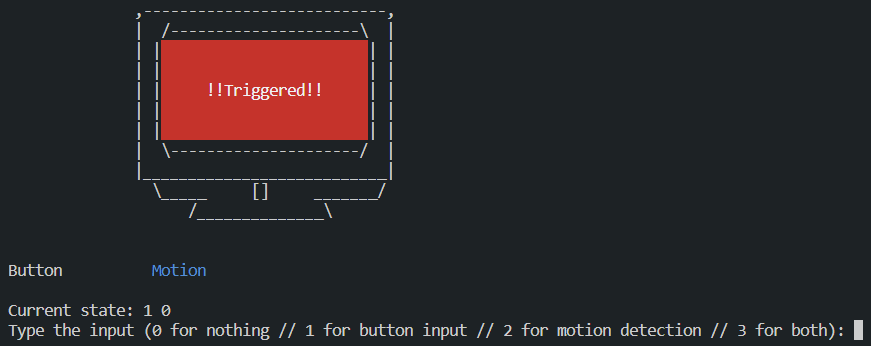

# Simple Security System with Finite State Machine

In this repo, I build a simple security system with a **Finite State Machine** and implement the system with **C Programming Language**.

Before we move further let's understand what is Finite State Machine or FSM

## Definition

Finite State Machine (FSM) is a mathematical model used to design and analyze systems that exhibit behavior that can be described as a sequence of transitions between a finite number of states.

An FSM consists of a set of states, a set of transitions between those states, and a set of inputs that trigger the transitions. The behavior of the system is determined by the sequence of transitions between states that occur in response to the inputs.

FSMs are often used to design and analyze systems that exhibit complex, state-based behavior, such as automated control systems, communication protocols, and computer programs. They are a useful tool for modeling systems that have a limited number of possible states and transitions, and can be used to design and analyze the behavior of systems in a variety of fields, including computer science, engineering, and security.

## Simple Security System

Now, let's talk about the system I've made.

#### Short Description

In my simple security system, I use **3 states** which are **Disarmed**, **Armed**, and **Triggered**. I also use **2 input devices** which are **Button** and **Motion Sensor**. The *Disarmed* state indicates that the security system is inactive and will not trigger an alarm if the motion sensor detected a movement made by the intruder. Then, the *Armed* state indicates that the security system is active and will trigger an alarm if the motion sensor is activated. And lastly, the *Triggered* state indicates that the security system is in the process of sounding an alarm caused by the movement recorded by the motion sensor.

#### State Transition

In this simple security system, I can move between states with a specific input entered to the system. The initial state is 'Disarmed', then when you press the button it will go to the 'Armed' state and it will wait until the motion sensor is activated. When the motion sensor is activated, it will go to the 'Triggered' state and it will notice the responsible guard. To stop the alarm, the button must be pressed in order to make the system go into 'Disarmed' state. I have prepared a Finite State Machine diagram to give a clear explanation about the transition of the simple security system.

From the diagram above I came up with this table.

And then from the table I came up with 4 Karnaugh maps

- ###### Next State (s0) Kmap

  

  

- ###### Next State (s1) Kmap

  

  

- ###### Output (o0) Kmap

  

  

- ###### Output (o1) Kmap

  

Finally from each Karnaugh map, I can form these expressions

$S0 = m b + s1 m + s0 m + s0 b'$

$S1 = s1m'b' + s0's1'm'b$

$O0 = s0$

$O1 = s1$

#### Scenarios

For better understanding, I have prepared some scenarios for operating this system:

1. A museum is closed at night and there are only 2 security guards guarding the valuable objects inside the museum. When the museum is closed at night, the standard operating procedure requires the simple security system to be turned on. So, one security guard pressed the button to change the state of the machine to 'Armed'. Two hours pass and everything goes as usual. Suddenly, a thief enters the museum and the two guards don't notice it because they are talking. Luckily, the thief passes the motion sensor that has been installed in the museum, and the alarm goes off to notify the guards. One guard enters the museum and the other guard guides his colleague by looking at the CCTV. Then the thief is caught and the button is pressed to stop the alarm.
2. A convenience store is closed at night and there is only 1 security guard guarding the place. As usual, the security guard pressed the button to make the system go to the 'Armed' state. After that, he needs to go to the toilet. Suddenly, a man enters the security room and tries to turn off the system. But then, he pressed some unknown key on the keyboard and the alarm goes off, which notifies the guard. Luckily, the guard catches the man who tried to interrupt the system.
3. A jewelry store owner needs to close his store at night. As usual, he presses a button to make the system go into the 'Armed' state and then locks the door. He does this every day. One time, a thief observes his behavior for a few days and thinks that he can enter the store before the store owner presses the button. When the system is in the 'Disarmed' state, the motion sensor will still detect motion but will not set off the alarm. The very next day, the thief runs into the store ready to take some very valuable items. However, the thief does not know where the motion detector is placed, and when the store owner presses the button, the thief passes the motion detector at the same time. Then the alarm goes off and the police come to catch the thief.

#### How to Run The System

Follow the step-by-step tutorial below on how to run the program:

1. [Click here](https://github.com/aubertlenno/simple-security-system/archive/refs/heads/main.zip) to download the folder as zip
2. Unzip the .zip file

3. Open **Terminal** if you are using Linux / macOS or use **WSL** if you are using Windows

4. Refer to [this link](https://learn.microsoft.com/en-us/windows/wsl/install-manual) on how to install WSL

5. Direct to the "simple-security-system" folder using `cd <folder path>`

6. Run `make`

7. The program will run and you will need to enter the input (0, 1, 2, or 3)

#### Output

The program will look like this when started

If the button is pressed, it will look like this

If the motion is detected, it will look like this

